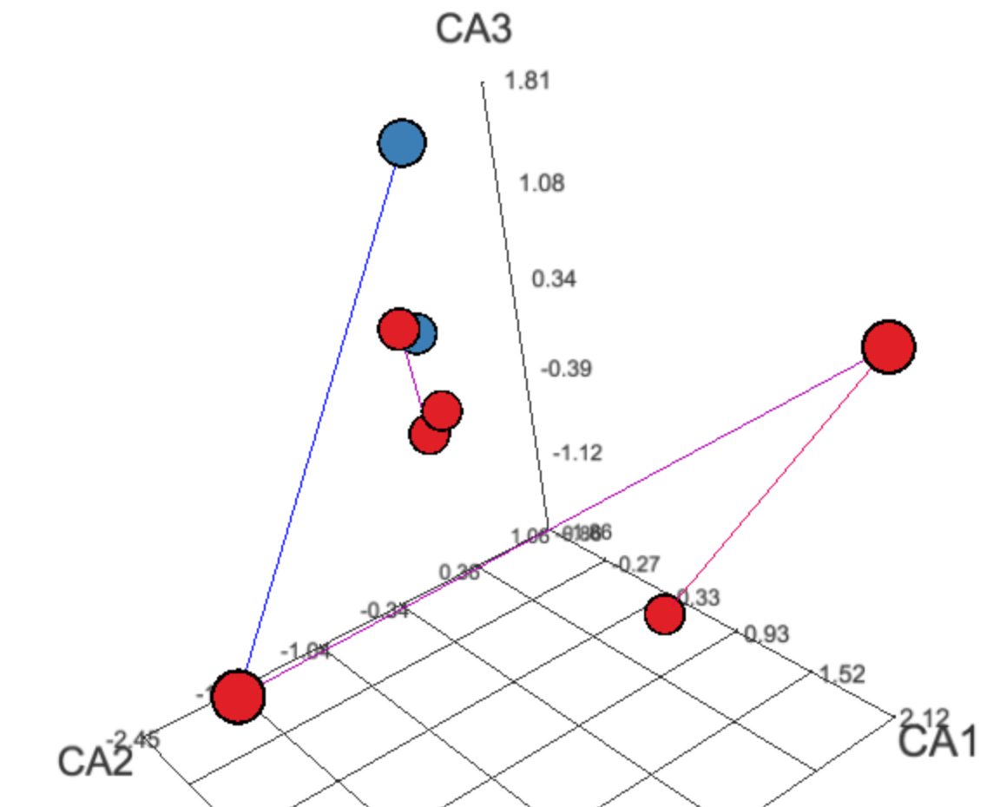
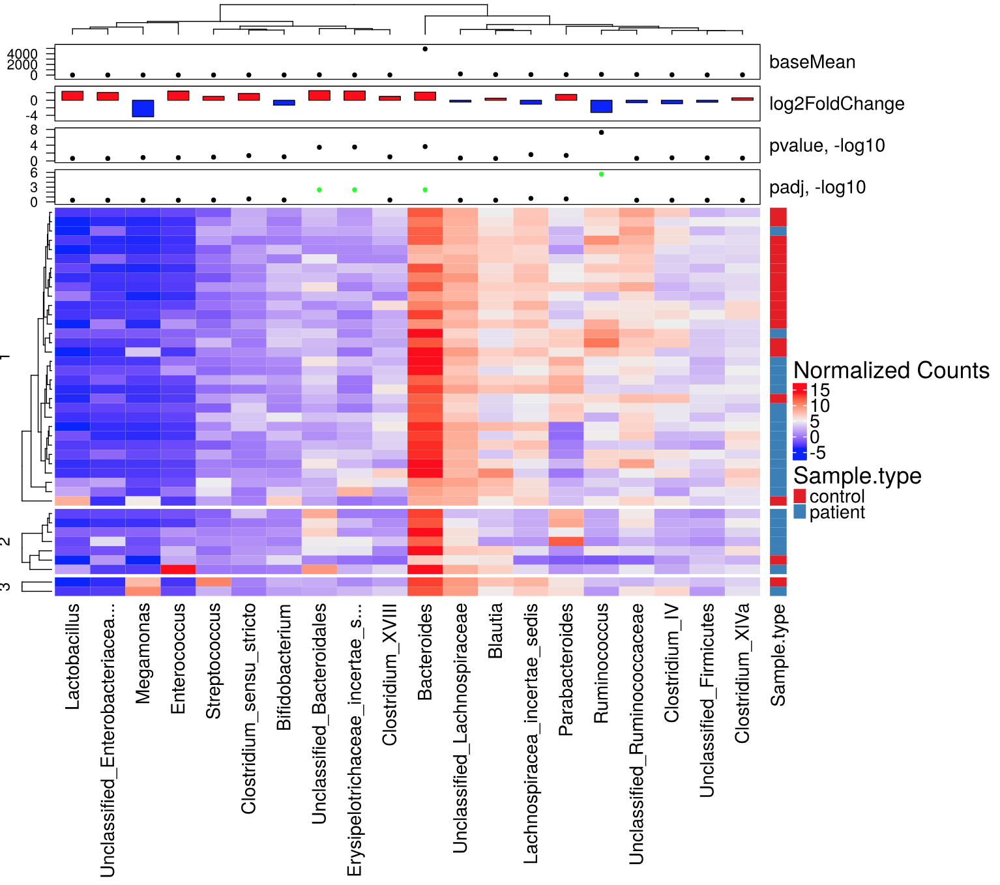
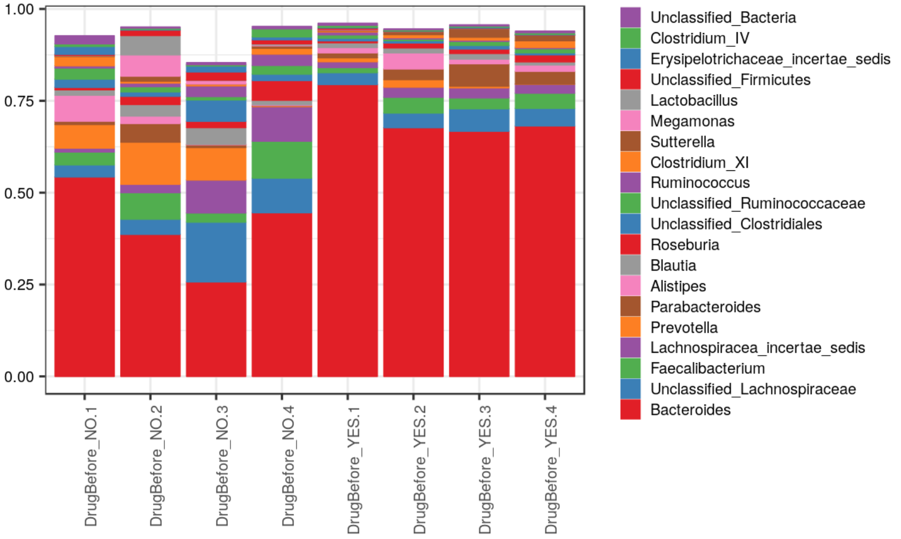

# MGSAT semi-automated differential abundance analysis of omics datasets #



## Overview ##
MGSAT is written in R. It applies several types of statistical tests, normalizations and plotting routines to the abundance count matrices that are typically the output of annotating (meta)omics datasets, and generates a [structured HTML report](https://andreyto.github.io/mgsat-examples/example_project_01/0-report.html) that, in addition to results, shows method parameters and versions of the external packages. 

The user has fine-grained control over types of tests, parameters, and a description of a study design through a named list data structure that is provided as input to the top-level routine of the package.

MGSAT has being used to analyse datasets from 16S gene environmental sequencing surveys, proteomics mass spectrometry and meta-genomics whole-genome shotgun functional annotation in several studies where the goal was to associate the state of the human microbiome or human proteome with a specific disease condition such as leukemia, diabetes or Respiratory syncytial virus (RSV).

For 16S surveys, MGSAT has routines that load output count matrices formatted as coming from [Mothur-based Standard Operating Procedure](http://www.mothur.org/wiki/MiSeq_SOP). The analysis can be done at all levels of annotated taxonomy or for the operational taxonomic units (OTU) / annotated sequence variants (ASV).
The subdirectory [examples/16S](examples/16S) contains example R code and WDL workflow for running [DADA2](https://benjjneb.github.io/dada2/index.html) and formatting the saving the ASV matrices in Mothur format. Look at 
[this folder](examples/16S/projects/mab_abx) for the driver script.

MGSAT targets study designs where the goal is to associate annotated omics data with clinical metadata variables. Between-, within-subject and mixed designs can be addressed. The analysis includes alpha and beta diversity, richness estimates, both abundance based and incidence based, tests for difference of diversity and richness between groups, PermANOVA test for abundance profile dissimilarities for either independent or paired samples, comparison of paired vs unpaired profile dissimilarities, stability ranking analysis based on rank sum and signed rank Wilcoxon tests, stability selection analysis based on elastic net classifier, [DESeq2](http://www.bioconductor.org/packages/release/bioc/html/DESeq2.html) differential abundance analysis based on a negative binomial model of abundance counts, and a binomial mixed model analysis where overdispersion is accounted for by a subject-specific random effect. Optional data normalizations includes simple proportions, inverse hyperbolic sine, Box-Cox, Aitchison and DESeq2 transforms.

Plots include abundance profile plots in different representations split by grouping variables or shown as trends along continuous metadata variables, as well as clustered heatmaps with overlayed panels showing metadata variables, and 2D or 3D ordinations. A number of dynamic JavaScript plots and tables are produced for an interactive exploration.



## Sample Analysis Code and Output ##
The easiest way to start using this package is to study the inputs and outputs of an example analysis project.

The project is a made-up (fictional) 16S sequencing study that supposedly looked at the association of a gut microbiome with some diet regimen. Samples were taken at several longitudinal points (called "visits" here), each visit coming after the next phase of diet regimen. Visit 1 was before the start of treatment. At Visit 1 (and a few at Visit 2), samples were also taken from healthy control individuals, each of which was matched with a corresponding patient. Some patients received a separate incidental drug treatment before coming for visit 1, which was reflected in a corresponding metadata variable. Note that because the enrollment was ongoing throughout  the study period, and the treatment was taking more than a year, there are progressively fewer samples at the higher visit numbers. There were no study drop-outs.

The input driver script [examples/example_project_01/example_project.r](examples/example_project_01/example_project.r) that the hypothetical user has created to run the analysis is included into the code repository along with the required Mothur count files and clinical metadata table. Comments within the script also describe how to install required R dependencies. You should also edit the location of the directory into which you checked out the MGSAT code. The analysis should run both on Linux and Windows. SNOW package is used for parallelization, with a default number of processes set to four.
The driver script expects to find its input files in the current working directory, and will generate the output report files in the same directory. The top-level HTML report file is called `0-report.html`. This file can be opened directly from disk (use Firefox or Chrome; Internet Explorer has compatibility issues). The same directory also contains Markdown files that served as source of the HTML files. They can be converted to other formats such as Microsoft Word by using [Pandoc](http://johnmacfarlane.net/pandoc/).

You can open the [pre-computed HTML reports](https://andreyto.github.io/mgsat-examples/) generated from running the example driver scripts (use Firefox, Chrome or other standard-compliant browser; Internet Explorer has compatibility issues).
The header section briefly describes how to navigate the report and subreports linked from its main page. Note that the report includes links to input files, as well as to various intermediate datasets in case user will want to re-analyze data in some custom ways. Each sections also describes the parameters used to run a specific method as well as references to corresponding R packages.

The user has analyzed data in subsets, such as controls vs patients before diet or patients before and after the start of the diet regimen. MGSAT placed the results for each subset into a separate subreport, linked from the top level page.

The example also shows how custom user analysis code `extra.method.task` can be injected into the pipeline and executed along with the already available methods. 

## How to run ##
The easiest way to start using MGSAT through the Docker image that we have built and made available at the [MGSAT Docker Hub Repository](https://hub.docker.com/r/andreyto/mgsat/).

MGSAT Docker image incorporates the open-source version of [RStudio&reg; Server](https://www.rstudio.com/products/rstudio-server/) as a Web GUI front-end. 
The image has been derived from the [Rocker](https://hub.docker.com/r/rocker/rstudio/) image. You can read [Rocker Wiki](https://github.com/rocker-org/rocker/wiki/Using-the-RStudio-image) for the full description of start-up options. In short, you can run MGSAT container with something like:
```
docker run --rm -d -p 8787:8787 -e PASSWORD=<put your arbitrary password here> andreyto/mgsat:1.4
```
Then, login to RStudio in your browser at the URL `your_docker_host:8787` with a user name `rstudio` and the password that you have provided in the `docker run` command.

Using RStudio `Files` pane or RStudio Tools->Shell menu, create new directory somewhere and create the driver R script in it. You can start that file by modifying a copy of `examples/example_project_01/example_project.r`.

After you run the driver script, you can open the generated report right from RStudio by clicking on `0-report.html` in the `Files` pane. Note that you also have the convenient `Upload` button in that pane that allows you putting input files for your analysis without leaving the RStudio UI.

### Trademarks in MGSAT Docker image ###
RStudio and the RStudio logo are registered trademarks of RStudio, Inc. The use of RStudio trademarks as they appear in an unmodified form of RStudio derived from [Rocker's permitted image](https://hub.docker.com/r/rocker/rstudio/) and as part of a free and open source bundle in MGSAT has been granted by explicit permission of RStudio. Please review RStudio's [trademark use policy](https://www.rstudio.com/about/trademark/) and address inquiries about further distribution or other questions to <permissions@rstudio.com>.

## Author ##
Andrey Tovchigrechko `<andreyto AT gmail.com>`

## License ##
GPLv3. See also COPYING file that accompanies the source code.

## Some publications that used MGSAT ##
```
Cohen, T. S., et al. (2018). "S. aureus Evades Macrophage Killing through NLRP3-Dependent Effects on Mitochondrial Trafficking." Cell reports 22(9): 2431-2441.
	
Rosas-Salazar, C., et al. (2016). "Nasopharyngeal microbiome in respiratory syncytial virus resembles profile associated with increased childhood asthma risk." American journal of respiratory and critical care medicine 193(10): 1180-1183.
	
Rosas-Salazar, C., et al. (2018). "Nasopharyngeal Lactobacillus is associated with a reduced risk of childhood wheezing illnesses following acute respiratory syncytial virus infection in infancy." Journal of Allergy and Clinical Immunology.
	
Rosas-Salazar, C., et al. (2016). "Differences in the nasopharyngeal microbiome during acute respiratory tract infection with human rhinovirus and respiratory syncytial virus in infancy." The Journal of infectious diseases 214(12): 1924-1928.
	
Shilts, M. H., et al. (2016). "Minimally invasive sampling method identifies differences in taxonomic richness of nasal microbiomes in young infants associated with mode of delivery." Microbial ecology 71(1): 233-242.
	
Suh, M.-J., et al. (2015). "Quantitative differences in the urinary proteome of siblings discordant for type 1 diabetes include lysosomal enzymes." Journal of proteome research 14(8): 3123-3135.
```


